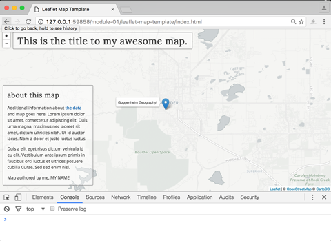
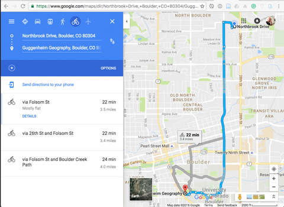
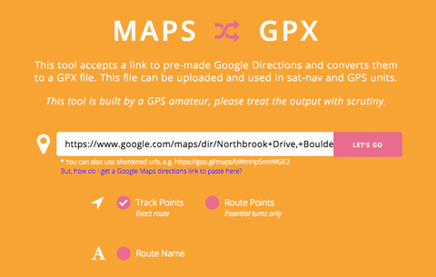
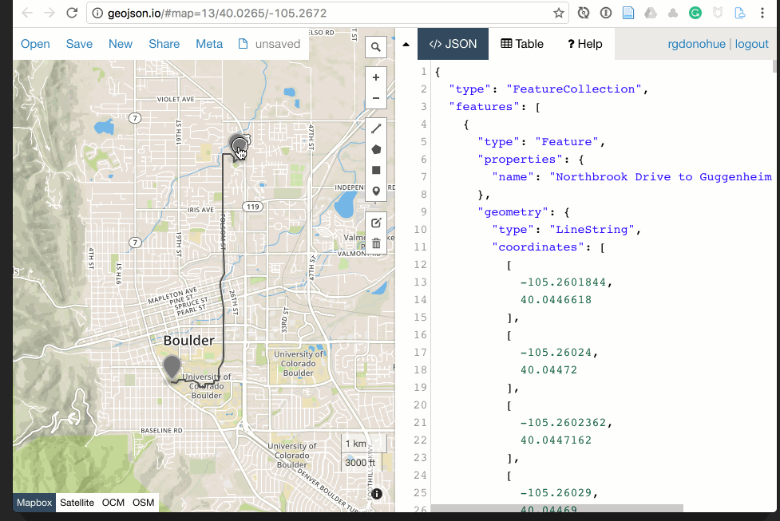
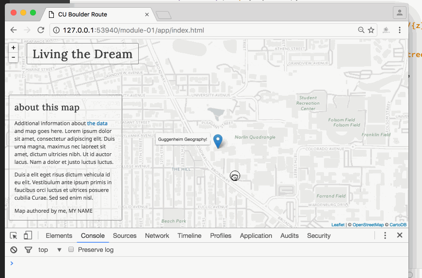
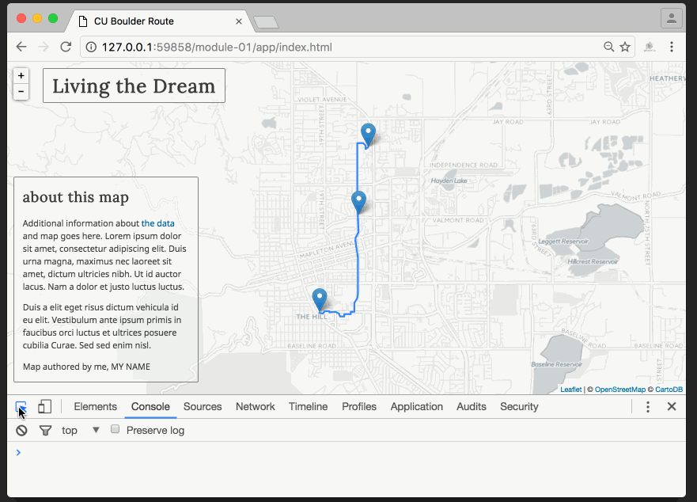
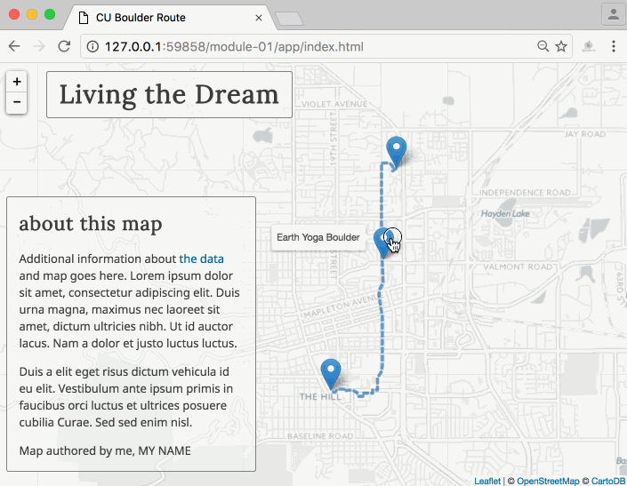

# Lesson 01. Drawing Data with Web Maps

To begin, clone or [download the course repository](https://github.com/rgdonohue/web-mapping-short-course) to your computer.

Clone or unzip the contents of the files in a known location (i.e., your Desktop or Documents). Briefly, examine the contents of the directory named `module-01`. 

## Setting up a development environment

There are many resources and tools for getting going with web mapping. But sometimes getting the development environment set up so you can write code and test your map is the first roadblock. Let's consider the principle components of a web development process:

**A Web Browser**

Web Mapping is an unusual form of Cartography in that we primarily make the maps using the same medium with which we develop them. The web browser is a crucial component of our technology stack. Most web map developers use Chrome or Firefox, as you should. Make sure your browser has installed recent updates.

**Web Developer Tools**

Modern web browsers come installed with web developer tools. These tools come loaded with functionality allowing you to investigate how a web page or application is structured and performing within your browser. Read more about using the [Chrome DevTools](https://developer.chrome.com/devtools), and as always look for the shortcuts to open and close the toolbar in your browser (Cmd + i in Mac OS).

Open your web developer toolbar.

  
**Figure 01.** Opening Chrome's Web Developer Tools.

One of the most useful features is the [Console](https://developer.mozilla.org/en-US/docs/Web/API/Console), which allows you to log JavaScript values within the browser. You can type directly into the Console, or log values from a JavaScript file loaded within the browser. We'll be doing both as we build and debug web maps.

**A Web Server**

While a web browser application interprets and renders the files that compose our web maps, they don't do this by themselves. They require a "server" to gather the files and deliver them to the browser correctly. A server is especially necessary when using JavaScript to make what are known as asynchronous requests to load files and data into our web application.

We develop a web application "locally" on our computer, so it's best to use a local server, or a "local test server," to do this. There are a few options for getting a local test server running on your machine.

1. [Python's SimpleHTTPServer](http://www.pythonforbeginners.com/modules-in-python/how-to-use-simplehttpserver/) module
2. A [WAMP server](http://www.wampserver.com/en/) for Windows or a [Mac OS alternative](http://ampps.com/download)
3. The use of Brackets text editor (see below)

**A Text Editor**

Developers build web maps by writing plain text. Text editors designed for web development facilitate this, particular by highlighting different parts of the code syntax. Install and open one of the following:

* [Brackets](http://brackets.io/)
* [Sublime](https://www.sublimetext.com/)
* [Atom](https://atom.io/)

Brackets is particularly handy if you don't have a local server running or don't know what that is. Its "Live Preview" functionality runs a local host within your web browser, which allows you to see and test your rendered web application.

**Directories, Files, Data, and Media**

The user's web browser assembles and renders the web page and map application using specific files. Minimally this will include an HTML index file for the direction, typically named *index.html*.

Using your text editor, open the *module-01/* directory. A good text editor allows you view and modify the contents of the directory. Again examine the contents of this directory from within the editor.


## Introducing the building blocks of a "hello world" web map

Let's begin with a simple working template for making a web map. 

Open the *[leaflet-map-template/index.html](https://github.com/rgdonohue/web-mapping-short-course/blob/master/module-01/leaflet-map-template/index.html)* within your browser. Be sure to open your file using the Live Preview of Brackets or using another local server.

If the map has loaded correctly, you should see a basemap centered within Boulder, CO. A marker is located at the Guggenheim building and a tooltip opens on the marker. There should also be no errors in the Developer Tool Console.

  
**Figure 02.** The Leaflet map templete loaded in the browser, with no errors in the Console.

How does the code contained within the *index.html* file work together to produce this map? Our web document is composed of 3 essential web technologies: HTML, CSS, and JavaScript. The web browser in turn creates a DOM or Document Object Module using this document.


### HTML (structure)

The HTML structures and describes the content of our document. Some of its elements (`<style>` and `<script>` tags) load additional files such as CSS, JavaScript, or image files into the document upon page load.

Study this skeleton HTML template:

```html
<!DOCTYPE html>
<html>

<head>
	<meta charset=utf-8 />
	<title>Leaflet Map Template</title>
	<meta name='viewport' content='initial-scale=1,maximum-scale=1,user-scalable=no' />
	
	<!-- load additional CSS files here and this is an HTML comment -->

	<style>
	
		/* CSS rules go here and this is a CSS comment */
		
	</style>
</head>

<body>

	<h1>This is the title to my awesome map.</h1>

	<!-- more HTML goes here -->

	<!-- load additional JS files here -->
	<script>
		
		// JavaScript goes here and this is a JS comment
		
	</script>

</body>

</html>
```

Read more about [HTML](https://developer.mozilla.org/en-US/docs/Web/HTML).

### CSS (form)

If the HTML structures our content, the primarly role of CSS is to give that structure form. We apply CSS rules to the web page and elements we draw to the map to adjust the "look and feel" of the page and map.

```css
body {
	margin: 0;
	padding: 0;
	background: whitesmoke;
	font-family: "Noto Sans", sans-serif;
	color: #3d3d3d;
}

h1 {
	position: absolute;
	margin-top: 0;
	top: 10px;
	left: 45px;
	font-size: 2em;
	font-family: "Lora", serif;
	letter-spacing: .04em;
	padding: 10px 15px;
	background: rgba(256, 256, 256, .4);
	border: 1px solid grey;
	border-radius: 3px;
	z-index: 800;
}

#map {
	position: absolute;
	top: 0;
	bottom: 0;
	width: 100%;
}

```

Read more about [CSS](https://developer.mozilla.org/en-US/docs/Web/CSS).

### JavaScript (behavior)

Finally, we use JavaScript to add event-driven and interaction behavior to our website; to make it dynamic! The following JavaScript creates the map within our page.


```javascript
var options = {
	center: [40.00816, -105.27423],
	zoom: 12
}

var map = L.map('map', options);

var tiles = L.tileLayer('http://{s}.basemaps.cartocdn.com/light_all/{z}/{x}/{y}.png', {
	attribution: '&copy; <a href="http://www.openstreetmap.org/copyright">OpenStreetMap</a> &copy; <a href="http://cartodb.com/attributions">CartoDB</a>',
	subdomains: 'abcd',
	maxZoom: 19
}).addTo(map);

var message = 'Guggenheim Geography!';

L.marker(map.getCenter())
	.bindTooltip(message)
	.addTo(map)
	.openTooltip();
```

Let's quickly review what the JavaScript above is doing:

1. The statement assigning an object to the variable `options` is specifying some of [Leaflet's map object's options](http://leafletjs.com/reference-1.0.0.html#map-option), here centering the map on Guggenheim and setting a zoom level to 12.

2. The next statement creates a [Leaflet map object](http://leafletjs.com/reference-1.0.0.html#map), inserts it into a DOM element with the `id` value of `map` (i.e., our `<div id='map'></div>` within our HTML, and applies the options we specified. 

3. The statement assigning a value to the variable `tiles` is a fun one. Leaflet uses this one to request a set of basemap tiles from a remote server. There are lots of these, and you can have fun swapping them out for one another until you find one appropriate for your map. Check out the options at [Leaflet Providers](https://leaflet-extras.github.io/leaflet-providers/preview/).

4. The final two statements assign a string value `'Guggenheim Geography!'` to the variable `message` and uses the Leaflet [L.Marker class](http://leafletjs.com/reference-1.0.0.html#marker) to place a marker at the center of the map, as well as the [Leaflet L.Tooltip class](http://leafletjs.com/reference-1.0.0.html#tooltip) to display our message on top of the map layers.

Read more about [JavaScript](https://developer.mozilla.org/en-US/docs/Web/JavaScript).

Let's now use this template to create a basic thematic map.

## Mapping scenario: mapping your route from home to campus

For this lesson, we're going to make a Leaflet map of your route to or from campus (pick one for now if they are different). The goal of the map is to allow the user to see your starting and ending points, the route between them, as well as a couple places of interest along the way. Perhaps you stop at a cafe or your place of work. We want to capture this geography, convert it to an appropriate data format, and display it on a web and mobile-friendly map. Additionally, we can allow the user to retrieve specific information about these places through interacting with the map (in this case, hovering over the map or touching on a marker).

To begin, copy the *leaflet-map-template/* directory and rename it to *app*.

### Step 1: Data aquisition and conversion

To get our data and convert it to an appropriate format for web mapping, we're going to use a few web-based tools. 

Let's first use a fantastic (proprietary) mapping resource: [Google Maps](https://www.google.com/maps)!

1. First, search for your primary campus building. For instance, I'll do a simple Google Map search for [Guggenheim Geography](https://www.google.com/maps/place/Guggenheim+Geography,+Boulder,+CO+80302/@40.0081521,-105.2764582,16.98z/data=!4m5!3m4!1s0x876bec31173b714d:0xfe71b5ee5f7fee43!8m2!3d40.0081661!4d-105.2742872).

2. Then use the Directions functionality to determine the route from your home to your building. **BE CAREFUL:** This map is going to end up on the web. Do you want people knowing your exact address? Maybe not! Use an approximate address location instead. Also, be sure to select the mode of travel. Do you drive a car, ride a bus, walk, or ride your bike? If you fly a plane to get to campus, that's incredible!

  
**Figure 03.** Using Google Maps to find a route and mode from home to Campus.

Google Maps allows you to pick between alternative routes, as well as to drag the route to customize the route you really take. Feel free to adjust this a little bit, but don't worry too much about it. We'll be using another tool to do this later on.

When you have highlighted your desired route in blue on the map, copy the entire URL from the address bar (highlight it, and select *Edit -> Copy* or *Cntr + C*).

3. Next, go to a website named [Maps To GPX](https://mapstogpx.com/), a tool that, "accepts a link to pre-made Google Directions and converts them to a GPX file." This is perfect for us!

Paste your URL from Google Maps into the form and hit "Let's Go." 

  
**Figure 04.** Converting Google Maps Route to GPX.

The site will make the necessary conversion and prompt the download of the GPX file (with a name something like *mapstogpx20161026_000913.gpx*). Move this file into the *module-01/app/data/* directory.

GPX (the GPS Exchange Format) is a text-based format derived from XML and often used to encode GPS data. You can open this file in your text editor to examine the contents. We're not too interested in particular file, but it looks like this:

```xml
<?xml version="1.0" encoding="UTF-8" standalone="no" ?>
<gpx xmlns="http://www.topografix.com/GPX/1/1" xmlns:gpxx="http://www.garmin.com/xmlschemas/GpxExtensions/v3" xmlns:gpxtpx="http://www.garmin.com/xmlschemas/TrackPointExtension/v1" creator="mapstogpx.com" version="1.1" xmlns:xsi="http://www.w3.org/2001/XMLSchema-instance" xsi:schemaLocation="http://www.topografix.com/GPX/1/1 http://www.topografix.com/GPX/1/1/gpx.xsd http://www.garmin.com/xmlschemas/GpxExtensions/v3 http://www.garmin.com/xmlschemas/GpxExtensionsv3.xsd http://www.garmin.com/xmlschemas/TrackPointExtension/v1 http://www.garmin.com/xmlschemas/TrackPointExtensionv1.xsd">
  <metadata>
    <link href="http://www.mapstogpx.com">
      <text>Sverrir Sigmundarson</text>
    </link>
    <!--desc>Map data ©2016 Google</desc-->
    <!--url>https://www.google.co.uk/maps/dir/40.035196,-105.2809662/40.008162,-105.27423/@40.0215947,-105.2933284,14z/data=!3m1!4b1!4m2!4m1!3e1?hl=en</url-->
    <time>2016-10-23T15:57:30Z</time>
  </metadata>
  <wpt lat="40.035196" lon="-105.2809662">
    <name>3315 13th Street</name>
    <desc>3315 13th Street, Boulder, CO 80304, USA</desc>
  </wpt>
```

If you happen to use the popular [Strava](https://www.strava.com/) service, you can also download all your routes in GPX format.

Next, we want to convert our data to another format: [GeoJSON](http://geojson.org/). GeoJSON is to web mapping what the Shapefile is to GIS.

Navigate your browser to a website called [geojson.io](http://geojson.io/). You'll want to bookmark this website, as it's an extremely useful online tool.

Open your GPX file in the geojson.io web application. Study the code generated in the right-hand panel; it is a valid GeoJSON encoding of your route. Unlike Shapefiles, GeoJSON can encode multiple geometry types within a single Feature Collection. Note that  Features have both `properties` and `geometry` attributes. The `"LineString"` type contains all the points that make up the route, while the two `"Point"` type Features encode the endpoints of the route.

Take some time to play around with the geojson.io website and your data.

Note that our process has retained some data attributes from Google Maps that we don't need. We can remove these, and edit the existing data properties as we wish. The web application also allows us to add, remove, and edit geometries. For example, you could modify your route.

  
**Figure 05.** Removing unneeded attribute properties in geojson.io.

Instead, let's add a couple more places of interest. Using the drawing tools, place a point of interest along your route. Add a property row to the marker, and be sure to use the word "name" as the name of the attribute (just like the other points). Geojson.io also adds some other properties to style the marker. We don't need these, and you can remove them in the editor.

  
**Figure 06.** Adding a placemarker in geojson.io.

Once you finish editing your data, choose **Save** and download as a GeoJSON (it will download with the file name *map.geojson*. Save or move this downloaded file into your *module-01/app/data/* directory.

You can open this file in your text editor to see that it's the same as what geojson.io displayed.

```js
{"type":"FeatureCollection","features":[{"type":"Feature","properties":{"name":"Northbrook Drive to Guggenheim Geography"},"geometry":{"type":"LineString","coordinates":[[-105.2601844,40.0446618],[-105.26024,40.04472],[-105.2602362,40.0447162],[-105.26029,40.04469],[-105.26033,40.04466],[-105.26043,40.04458],[-105.26056,40.04451],[-105.26065,40.04448],[-105.2607,40.04447],[-105.26073,40.04447],[-105.26075,40.04446],[-105.26078,40.04443],[-105.2608,40.04439],[-105.26083,40.04438],[-105.26086,40.04437],[-105.26093,40.04436],[-105.2609275,40.0443637],[-105.26094,40.0444],[-105.26095,40.04446]
```

This last step of modifying our data attributes, editing the geometries, and exporting to GeoJSON wraps up our data acquisition and conversion process. Next, let's get the data loaded into the web map.

### Step 2: Loading external data into a web document.

There are various ways to load GeoJSON data into your web map. While the best (and more sophisticated) way is to make an [AJAX](https://en.wikipedia.org/wiki/Ajax) request, we'll begin with a more simple solution.

First, rename the *map.geojson* file to *route.js*. Then open the *route.js* file in your text editor and assign the entire GeoJSON structure to a variable named *data*:

```js
var data = {"type":"FeatureCollection","features":[{"type":"Feature","properties":{"name":"Northbrook Drive to Guggenheim Geography"},"geometry":{"type":"LineString","coordinates":[[-105.2601844,40.0446618],[-105.26024,40.04472],[-105.2602362,40.0447162],[-105.26029,40.04469],[-105.26033,40.04466],[-105.26043,40.04458],[-105.26056,40.04451],[-105.26065,40.04448],[-105.2607,40.04447],[-105.26073,40.04447],[-105.26075,40.04446],[-105.26078,40.04443],[-105.2608,40.04439],[-105.26083,40.04438],[-105.26086,40.04437],[-105.26093,40.04436],[-105.2609275,40.0443637],[-105.26094,40.0444],[-105.26095,40.04446]
```

Save those changes to the file. GeoJSON is essentially a JavaScript object, and we've simply assigned it to a JavaScript variable. The variable `data` will now be available to us within our script. 

Next open the *index.html* file within our *module-01/app/* directory.

The script is currently loading the external using the `<script>` element, remote jQuery and Leaflet JavaScript files before our custom code executes. Let's load this JavaScript file into our document, in the same way, being careful to specify a relative path to our file contained within the *data* directory.

Add the line `<script src="data/route.js"></script>` to our *index.html* file, beneath where we load the external JavaScript files but (importantly) BEFORE the `<script></script>` tags enclosing our custom JavaScript.

```javascript
<script src="http://code.jquery.com/jquery-3.1.1.min.js"></script>
<script src="https://unpkg.com/leaflet@1.0.1/dist/leaflet.js"></script>

<script src="data/route.js"></script> // OUR DATA LOADED HERE!

<script>

    var options = {
        center: [40.00816, -105.27423],
        zoom: 12
    }
```

This step saved our GeoJSON file within a JavaScript file, assigned it to a variable, and modified the HTML to load the file on page load.

Now it's time to draw it to our map!

### Step 3: Drawing GeoJSON to the map.

With our *route.js* file loaded into the document and the Leaflet JavaScript library available to us in our script, we're ready to draw the GeoJSON data to the map. Leaflet makes this very easy for us with its [L.GeoJSON](http://leafletjs.com/reference-1.0.0.html#geojson) method. You'll likely want to spend some time studying these options and methods.

First, comment out the following code from the template:

```javascript
//        var message = 'Guggenheim Geography!';
//
//        L.marker(map.getCenter())
//            .bindTooltip(message)
//            .addTo(map)
//            .openTooltip();
```

Next, write or paste the following statements beneath that commented out code:

```javascript
var myRoute = L.geoJson(data).addTo(map);

map.fitBounds(myRoute.getBounds());

```

Save your file, refresh your browser, and you can see that Leaflet has drawn your data to the map. As always, keep your developer tools open and check for any JavaScript errors in the Console. You may need to re-adust the pan and zoom level to see the extent of your data.

  
**Figure 07.** Drawing the GeoJSON data to the map using L.GeoJson.

We've successfully drawn the the GeoJSON data to the Leaflet map using Leaflet's default styling options. Leaflet has rendered the LineString feature in the browser as an SVG path element within Leaflet's [overlayPane](http://leafletjs.com/reference-1.0.0.html#map-overlaypane) and the Point features on top of the line within Leaflet's [markerPane](http://leafletjs.com/reference-1.0.0.html#map-markerpane)

  
**Figure 08.** Inspecting the SVG and img elements within the DOM, as drawn by Leaflet.

Next, let's do some simple adjustments to the styles applied to these features.

### Step 4: Styling the features.

Since we want to style the line representing our route and the markers representing our pertinent places, it makes sense to separate these into different objects within our script. We're going to call the `L.geoJson()` method twice and filter the data based on its geometry type (recall that we have both LineString and Point features within this GeoJSON).

To do so, we'll use [L.GeoJson's filter method](http://leafletjs.com/reference-1.0.0.html#geojson-filter). 

Replace the line `var myRoute L.geoJson(data).addTo(map);` with the following code block:

```javascript
var myRoute = L.geoJson(data, {

    filter : function(feature) {
        if(feature.geometry.type == "LineString") {
            return feature;
        }
    },
    style : function(feature) {

        return {
            color: "#005DAA",
            weight: 4,
            opacity: .6,
            dashArray: "5, 5"
        }        
    }

}).addTo(map);

var myStops = L.geoJson(data, {

    filter : function(feature) {
        if(feature.geometry.type == "Point") {
            return feature;
        }
    },
    onEachFeature : function(feature, layer) {

        console.log(feature.properties)
    }

}).addTo(map);
```

Save your file and refresh the browser. 

  
**Figure 09.** The map line feature styled with Leaflet Path options.


You'll see we've now drawn the line according to these rules: 

```javascript
color: "#005DAA",
weight: 4,
opacity: .6,
dashArray: "5, 5"
```

These are Leaflet styling options inherited from the [L.Path](http://leafletjs.com/reference-1.0.0.html#path) class. Play around with these values to change the representation of the line.

We also see that we've logged some values to the Console, accessing these values through `feature.properties` as the L.GeoJson's `onEachFeature` method loops through our features. 

We can use L.GeoJSON's `onEachFeature` method not only to access information stored originally within our GeoJSON data but also to add some interactivity to our map.

### Step 5: Adding user interaction.

Replace the `console.log()` statement with the following statement:

```javascript
layer.bindTooltip(feature.properties['name']);    
```

Now when you test in the browser, you'll verify that the user will be able to retrieve specific information about these features by mousing over (or touching on a touchscreen interface) a specific feature.

  
**Figure 10.** Inspecting the SVG and img elements drawn by Leaflet.

### Step 6: Making the map whole: titles, information, and metadata.

The last step of making many maps is refining the design and clarifying the message or experience. Adding information about the map through descriptive (or fun) titles and side columns helps guide your user's understanding of the map. Also, be sure to include the map author (you), as well as any useful links to your online portfolios or work.


## Further challenges
